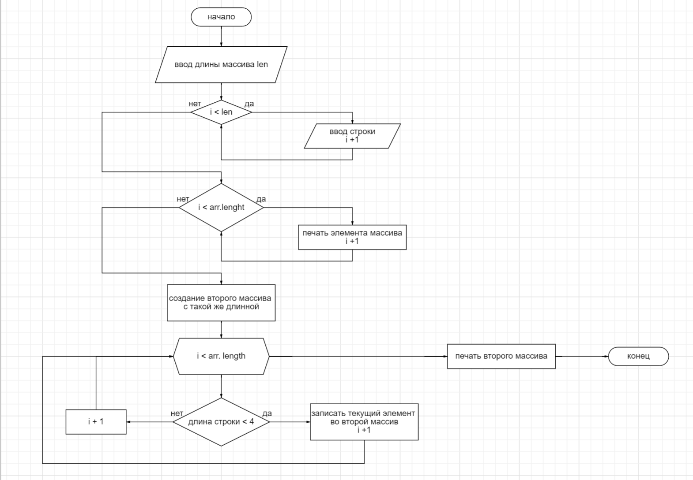

# controlWork - Контрольная работа

## Задача:
Написать программу, которая из имеющегося массива строк формирует новый массив из строк, длина которых меньше, либо равна 3 символам. Первоначальный массив можно ввести с клавиатуры, либо задать на старте выполнения алгоритма. При решении не рекомендуется пользоваться коллекциями, лучше обойтись исключительно массивами.

### Этапы подготовки к решению задачи:
1. Создание локальной папки для файлов контрольной работы
2. Создание репозитория на GitHub
3. Git inite для новой папки и git clone папки из гитхаба в папку с проектом 
4. Редактирование файла README для описания работы над задачей
- текстовое описание
- создание блок-схемы
- git add, git commit по завершению этапа

### Решение задачи:
1. Создание метода для ввода массива строк
2. Метод печати массива
3. Метод изменения массива с условием длина <=3
4. Печать измененного массива

### Блок-схема решения:
